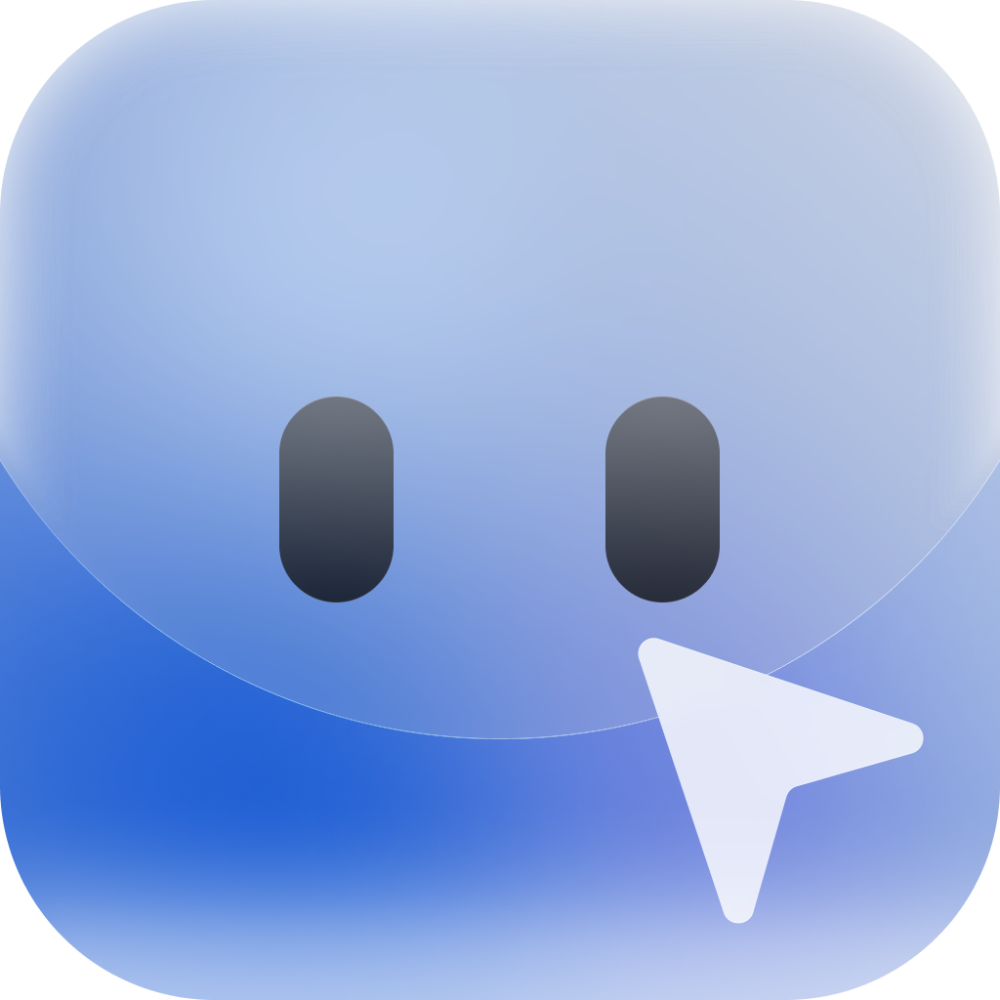

<p align="center">
  
</p>

# Notch Agent

Notch Agent is a MacOS-native AI Agent: sees what you see and use what you use, directly in your computer, collaborating with you seamlessly

## Vibe? or Coding?

Notch is an experimental project exploring the future of Human-Agent collaboration diagram. 
So Notch is more vibey but under high-level control. Do not consider this a production-ready product. 
Instead, imagine the experience with your MacOS-native AI agent.

## Architecture

- **Shell**: Swift / SwiftUI parent process for the notch UI and macOS-native kits.
- **Sidecar**: Bun / TypeScript child process for agent runtime, sessions, tools,
  context, and LLM orchestration.
- **Channel**: stdio JSON-RPC 2.0 between Shell and Sidecar. Swift `Codable`
  schemas are the source of truth; TypeScript types are generated from them.

## Requirements

- macOS Tahoe
- Swift 5.10+
- Bun 1.1+

## Development

```sh
./Scripts/run.sh
```

Build the app bundle without launching:

```sh
./Scripts/build-app.sh
```

Run tests:

```sh
swift test
(cd sidecar && bun test)
```

## Project Map

- `Sources/Shell` — notch UI, app composition, and Shell-side RPC wiring.
- `Sources/OSSenseKit` — read-side OS state snapshotting.
- `Sources/ComputerUseKit` — macOS app/window/snapshot/capture foundation.
- `Sources/RPCSchema` — JSON-RPC wire schema.
- `sidecar` — TypeScript agent runtime.
- `docs/designs` and `docs/plans` — architecture notes and feature plans.

## Status

Early development.
