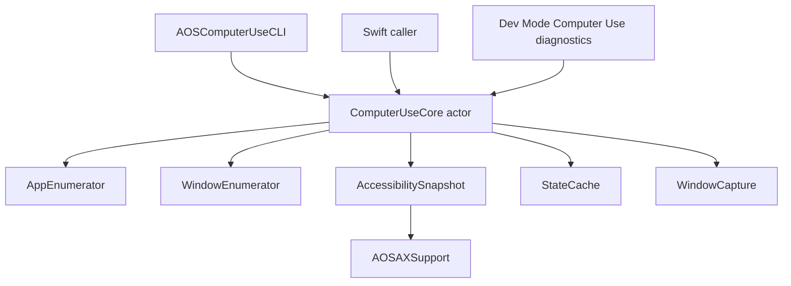

# Computer Use Foundation 设计

## 当前边界

Computer Use 现在保留 macOS app/window/snapshot/capture foundation，并提供
in-process non-raising focus、background mouse/keyboard event foundation，以及
基于 app-state `stateId + elementIndex` 的 AX element semantic event foundation。
Shell 通过 `computerUse.*` JSON-RPC request handler 把明确批准的业务 surface
暴露给 Sidecar agent tool 系统；Sidecar tool 只做薄 RPC 包装，不包含额外操作语义或 fallback。

已移除：

- 旧的宽泛 Shell `computerUse.*` handler / Sidecar `computer_use_*` tool surface
- Keyboard injection / VisualCursor
- Dev Mode 操作 workbench 与 coordinate reliability target

## 保留模块

```
Sources/AOSComputerUseKit/
  ComputerUseCore.swift
  Apps/
    AppInfo.swift
    AppEnumerator.swift
  Windows/
    WindowInfo.swift
    WindowEnumerator.swift
    WindowCoordinateSpace.swift
  AppState/
    AccessibilitySnapshot.swift
    TreeRenderer.swift
    StateCache.swift
  Capture/
    WindowCapture.swift
    ScreenInfo.swift
  Input/
    BackgroundMouseEvent.swift
    BackgroundMouseEventDelivery.swift
    MouseEventPoster.swift
    BackgroundKeyboardEvent.swift
    KeyboardEventPoster.swift
    AXElementEvent.swift
    AXFocusStealPreventer.swift
    AXElementEventPoster.swift
```

`AOSComputerUseKit` 仍依赖 `AOSAXSupport`，用于 shared AX primitives、Chromium / Electron web accessibility activation、`_AXUIElementGetWindow` bridging。`AOSOSSenseKit` 和 `AOSComputerUseKit` 可以共同依赖 `AOSAXSupport`，但不得互相依赖。

## Public API

`ComputerUseCore` 是当前唯一门面：

- `listApps(mode:) -> [AppInfo]`
- `getAppType(pid:) -> AppTypeResult`
- `listWindows(pid:) -> [WindowInfo]`
- `getAppState(pid:windowId:captureMode:maxImageDimension:) -> AppStateBundle`
- `startAppSession(pid:windowId:) -> AppSessionResult`
- `stopAppSession() -> AppSessionResult`
- `currentAppSession() -> AppSessionResult`
- `postMouseEvent(windowId:event:) -> WindowMouseEventResult`
- `postKeyboardEvent(windowId:event:) -> WindowKeyboardEventResult`
- `postEventToAXElement(pid:windowId:stateId:elementIndex:event:) -> AXElementEventResult`

Diagnostics 不属于业务 surface，统一挂在 core 的 diagnostics namespace 下：

- `core.diagnostics.focusWindowWithoutRaise(pid:windowId:) -> WindowFocusResult`
- `core.diagnostics.postMouseEventTrace(windowId:event:) -> WindowMouseEventTraceResult`
- `core.diagnostics.observeWindowOrder(pid:windowId:durationMilliseconds:intervalMilliseconds:) -> [WindowOrderObservationSample]`

因此外部 target 仍只持有 `ComputerUseCore`；诊断命令不会直接依赖
`WindowCapture`、`AccessibilitySnapshot`、`WindowEnumerator`、`WindowOrderProbe` 等
implementation 类型。Kit 对外公开的是 core、diagnostics namespace、以及 core
入参/返回值需要的 value types。

`getAppState` 支持两种 capture mode。AX tree 每次都会构建并返回：

- `vision`：AX tree + screenshot
- `ax`：仅 AX tree

AX tree 输出对齐 Codex Computer Use 的操作视角：每个 rendered AX node 都有
`elementIndex`，包括 container、text、image、toolbar、menu bar 等非 action 节点；
`StateCache` 保存同一份 index -> live `AXUIElement` map。渲染层使用可读 role/action
名称，例如 `text field (settable, string)`、`scroll area`、`Secondary Actions:
Scroll Down`，同时保留 `ID`、`Description`、`Placeholder`、`Help` 等定位信息。
为保持输出可信，AX focused summary 不输出；focus 状态容易停在结构容器上，错误摘要
比缺省摘要更误导。菜单栏只输出 closed menu bar items，不展开 closed `AXMenu` child；
多段静态文本组会合并成一条 text，低价值 `_NS:` id 和 implementation-only actions 会被过滤。

`BackgroundMouseEvent` 是鼠标行为层，当前表达 click 和 drag。`BackgroundMouseEventDeliveryRoute`
是投放路径层，当前将 AppKit route 和 web-content SkyLight route 分开。`ComputerUseCore`
只编排 validation、app session、focus、event post、window-order guard 和 cleanup，不保留
left-click 兼容包装。`startAppSession` 是唯一能切换 current app session 的入口；
mouse / keyboard event post 不接收 pid，必须在 active app session 内按 windowId 投放。
core 只在 session 中记录 pid；每次 event post 都用 current session pid 校验传入
windowId 的 ownership，并在需要投放前重新 focus 该 window。`stopAppSession` 现场读取
frontmost window，按 session pid 重新枚举当前所有 layer-0 windows，并只对非 frontmost
的 session windows 执行 target deactivation cleanup。

AppKit route 只支持 left/right click。Drag 仍是鼠标行为层的一种 event，但只由
web-content route 承接。

`postEventToAXElement` 是独立于 coordinate mouse/keyboard session 的 AX 语义投放路径，
不进入 app session，也不复用 coordinate window-order guard。调用方必须传入同一次
`getAppState` 返回的 `stateId` 与 `elementIndex`；core 只校验 `pid/windowId`
ownership，并从 `StateCache` 取活体 `AXUIElement`。AX 投放层采用 CUA-style 专用
focus suppression：先做 Chromium/Electron AX activation，再用临时 synthetic AX focus
包住 `AXPerformAction` / `AXSetAttribute`，同时在 AX action 周期内监听
`NSWorkspace.didActivateApplicationNotification`；如果目标 app 自激活，立即重新 activate
原前台 app。AX scroll 先尝试目标元素 advertised 的 scroll action
（如 `AXScrollDownByPage`），没有 action 时再寻找 `AXVerticalScrollBar` /
`AXHorizontalScrollBar` 并写 scrollbar `AXValue`；没有明确 AX scroll 能力时直接失败，
不自动退回 keyboard scroll。

## Sidecar tool surface

Sidecar agent 只暴露以下业务工具名，并一一映射到 `ComputerUseCore` 业务接口：

- `list_apps` -> `listApps(mode:)`
- `list_windows` -> `listWindows(pid:)`
- `get_app_state` -> `getAppState(pid:windowId:captureMode:maxImageDimension:)`
- `start_app_session` -> `startAppSession(pid:windowId:)`
- `stop_app_session` -> `stopAppSession()`
- `use_mouse` -> `postMouseEvent(windowId:event:)`
- `use_keyboard` -> `postKeyboardEvent(windowId:event:)`
- `perform_AX_action` -> `postEventToAXElement(pid:windowId:stateId:elementIndex:event:)`

Shell owns the live `ComputerUseCore` instance and registers `computerUse.*`
request handlers on the stdio JSON-RPC channel. `Sources/AOSRPCSchema/ComputerUse.swift`
defines the wire DTOs; `Sources/AOSShell/Agent/ComputerUseRPCService.swift` maps
those DTOs into Kit value types. Sidecar registers the eight tools in
`sidecar/src/agent/tools/computer-use.ts` after the live `Dispatcher` is available.

Not exposed as agent business tools:

- `getAppType(pid:)`
- `currentAppSession()`
- `core.diagnostics.*`
- CLI-only diagnostics such as coordinate target, post-cursor, window-order measurement,
  and mouse-event observation.

Dev Mode can still inject `ComputerUseCore` directly and use `core.diagnostics`
for local diagnostics.

## CLI

`AOSComputerUseCLI` 是 terminal-only interface，用于不启动整个 AOS Shell 时直接调用 `ComputerUseCore`。CLI 的 argv parsing、stdout/stderr formatting、exit code、permission prompts、screenshot file output 都在 executable target 内部；foundation 能力仍由 `AOSComputerUseKit` 提供。依赖方向固定为：

```
AOSComputerUseCLI -> AOSComputerUseKit -> AOSAXSupport
```

`AOSComputerUseKit` 不依赖 CLI、Shell、Sidecar 或 RPC。

CLI target 内部按职责拆分：

- `AOSComputerUseCLIExecutable.swift`：executable 入口，只允许进入 interactive host 或打印 help。
- `ComputerUseCLI.swift`：command facade、dispatch、shared command helpers。
- `Types.swift`：shared CLI result types。
- `Parser.swift`：argv parsing、usage errors、command request models。
- `Outputs.swift`：stdout / JSON output DTO 和 readable formatting。
- `CoreClient.swift`：CLI command runner 的 test seam；production 直接传入 `ComputerUseCore`。
- `DiagnosticClients.swift`：mouse-event diagnostic observer；window-order diagnostics 通过 `core.diagnostics` 调用 Kit。
- `Permissions.swift`：permission prompt client。
- `CoordinateTarget.swift`：coordinate probe process launcher。
- `InteractiveCommand.swift` / `InteractiveRuntime.swift`：long-lived interactive command palette、bounded scrolling selection viewport、Output/Error section rendering、command argument collection。
- `PostCursor.swift` / `PostCursorRuntime.swift`：interactive cursor command 和 terminal / overlay runtime。

executable 只支持：

- `swift run AOSComputerUseCLI --help`
- `swift run AOSComputerUseCLI help`
- `swift run AOSComputerUseCLI interactive`

standalone command execution 已移除。除 `help` / `--help` / `interactive` 外，直接用
executable 调用命令会返回 usage error；Computer Use CLI 之后固定是一个持有同一个
`ComputerUseCore` 的 interactive host。

interactive command palette 支持：

- `grant-permissions`
- `list-apps`
- `list-windows`
- `get-app-type`
- `get-app-state`
- `focus-window`
- `start-app-session`
- `stop-app-session`
- `left-click`
- `right-click`
- `drag`
- `type-text`
- `press-key`
- `hotkey`
- `measure-left-click-window-order`
- `observe-window-order`
- `observe-mouse-events`
- `post-cursor`
- `open-coor-test`
- `post-ax-event`

`left-click` and `right-click` accept `--count`; the default is 1. Counts above
1 are delivered as repeated down/up pairs at the same coordinate, with the
target pair's click state increasing from 1 through `count`.

成功默认输出人类可读文本到 stdout。传 `--json` 时输出机器可读 JSON。错误输出到 stderr，并返回非 0 exit code。`get-app-state --json` 默认把 screenshot base64 放进 JSON；如果传 `--screenshot-output`，CLI 把截图写入指定路径，JSON 只返回截图 metadata 和 `outputPath`。

`start-app-session` / `stop-app-session` 直接暴露 `ComputerUseCore.startAppSession` 和
`ComputerUseCore.stopAppSession`。`start-app-session` 需要 pid 和一个用于进入 session 的
windowId；session 内只记录 pid。后续 mouse / keyboard / trace / measurement /
post-cursor 命令每次都要求选择当前 windowId，并使用 current session pid 校验 window
ownership。没有 active app session 时 event command 直接失败。`stop-app-session` 重新枚举
session pid 下当前所有窗口，只对非 frontmost 的 session windows 执行 deactivate cleanup。
`post-ax-event` 不使用 active app session；它要求显式传入 pid、windowId、stateId 和
elementIndex，并投放 `--focus`、`--action`、`--set-value`、`--set-selected-text` 或
`--scroll` 其中一种 AX semantic event。
`focus-window`、trace 和 window-order observe 是 CLI diagnostics command，通过
`core.diagnostics` 调用，不进入业务协议。

`interactive` 是 CLI 内置的 long-lived host：进入后创建一次 `ComputerUseCore`，
所有后续 command palette 操作都复用这个 core。所有 interactive UI 区域都使用
`Title` + underline 的 section 形态，例如 `Command` / `-------`、`Output` / `------`、
`Error` / `-----`。主菜单和枚举值选择使用 Up/Down/Enter/Q，并以固定高度 viewport
滚动显示，避免长列表一次性展开污染 terminal 历史。Command 菜单还支持直接输入前缀，
按 command title 做 case-insensitive prefix match；Backspace 删除前缀字符。pid/window、坐标、文本等开放值仍通过
prompt 输入，输入完成后会清理 prompt 行。命令结果统一输出在可替换的 `Output` / `Error`
section，随后 command palette 在自己的可清理区域重绘。该模式用于本地诊断 app session lease：
可以先 `start-app-session`，继续投放 mouse / keyboard event 或观察状态，最后显式
`stop-app-session` 走 cleanup 路径。interactive host 正常退出时也会尝试 finally-style
`stopAppSession`；可执行进程收到 `SIGINT` / `SIGTERM` 时会尽力先清理 active app session
再退出。

`post-cursor` 保留 terminal 初始说明、drag stage 提示、posted event summary 和最终结果；
方向键移动过程中只更新 overlay，不再输出 `cursor local ...` 位置日志。

`grant-permissions` 会请求 Computer Use core 所需的两项权限：

- Accessibility：AX tree / actionable element snapshot 需要。
- Screen Recording：ScreenCaptureKit window screenshot 需要。

该命令会触发 macOS 系统 prompt，并打开对应的 System Settings Privacy pane。授权对象是运行 CLI 的 terminal app（例如 Terminal、Ghostty、Cursor 内置终端），不是 SwiftPM target 名本身。

## 数据流



## 约束

- Sidecar tool 只暴露上述 8 个业务入口。
- 只通过显式 background mouse / keyboard event API 投放输入事件。
- 不抢占用户前台应用焦点。
- 不通过 Sidecar 暴露 diagnostics surface。
- 不保留操作相关 fallback 或 stub；core 或 RPC 映射错误直接失败并冒泡。

未来扩展 app 操作能力时，应在这个 foundation 上新增明确边界，而不是重新引入隐式 handler 或半可用 tool surface。
