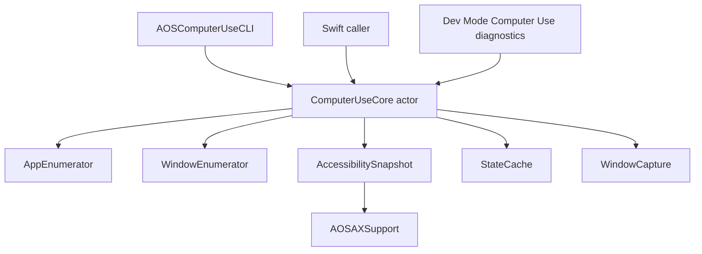

# Computer Use Foundation 设计

## 当前边界

Computer Use 现在保留 macOS app/window/snapshot/capture foundation，并提供
in-process non-raising focus 与 background mouse event foundation。它不再暴露给
Sidecar，也不包含 Sidecar tool 级 app 操作能力。

已移除：

- Shell `computerUse.*` JSON-RPC handler
- Sidecar `computer_use_*` tools
- Keyboard injection / VisualCursor
- Dev Mode 操作 workbench 与 coordinate reliability target

## 保留模块

```
Sources/AOSComputerUseKit/
  ComputerUseCore.swift
  Apps/
    AppInfo.swift
    AppEnumerator.swift
  Windows/
    WindowInfo.swift
    WindowEnumerator.swift
    WindowCoordinateSpace.swift
  AppState/
    AccessibilitySnapshot.swift
    TreeRenderer.swift
    StateCache.swift
  Capture/
    WindowCapture.swift
    ScreenInfo.swift
  Input/
    BackgroundMouseEvent.swift
    BackgroundMouseEventDelivery.swift
    MouseEventPoster.swift
```

`AOSComputerUseKit` 仍依赖 `AOSAXSupport`，用于 shared AX primitives、Chromium / Electron web accessibility activation、`_AXUIElementGetWindow` bridging、locator support。`AOSOSSenseKit` 和 `AOSComputerUseKit` 可以共同依赖 `AOSAXSupport`，但不得互相依赖。

## Public API

`ComputerUseCore` 是当前唯一门面：

- `listApps(mode:) -> [AppInfo]`
- `listWindows(pid:) -> [WindowInfo]`
- `getAppState(pid:windowId:captureMode:maxImageDimension:) -> AppStateBundle`
- `focusWindowWithoutRaise(pid:windowId:) -> WindowFocusResult`
- `startAppSession(pid:windowId:) -> AppSessionResult`
- `stopAppSession() -> AppSessionResult`
- `postMouseEvent(pid:windowId:event:) -> WindowMouseEventResult`
- `postKeyboardEvent(pid:windowId:event:) -> WindowKeyboardEventResult`

`getAppState` 支持两种 capture mode。AX tree 每次都会构建并返回：

- `vision`：AX tree + screenshot
- `ax`：仅 AX tree

`BackgroundMouseEvent` 是鼠标行为层，当前表达 click 和 drag。`BackgroundMouseEventDeliveryRoute`
是投放路径层，当前将 AppKit route 和 web-content SkyLight route 分开。`ComputerUseCore`
只编排 validation、app session、focus、event post、window-order guard 和 cleanup，不保留
left-click 兼容包装。任意 mouse / keyboard event post 会自动 `startAppSession`；
只有显式 `stopAppSession` 或切换到不同 target 时才执行 target deactivation cleanup。

AppKit route 只支持 left/right click。Drag 仍是鼠标行为层的一种 event，但只由
web-content route 承接。

该 API 是 in-process Swift API。当前没有 JSON-RPC schema、Sidecar tool schema 或 Shell handler 绑定 background mouse event。Dev Mode 可以直接注入 `ComputerUseCore` 做本地 diagnostics。

## CLI

`AOSComputerUseCLI` 是 terminal-only interface，用于不启动整个 AOS Shell 时直接调用 `ComputerUseCore`。CLI 的 argv parsing、stdout/stderr formatting、exit code、permission prompts、screenshot file output 都在 executable target 内部；foundation 能力仍由 `AOSComputerUseKit` 提供。依赖方向固定为：

```
AOSComputerUseCLI -> AOSComputerUseKit -> AOSAXSupport
```

`AOSComputerUseKit` 不依赖 CLI、Shell、Sidecar 或 RPC。

CLI target 内部按职责拆分：

- `AOSComputerUseCLIExecutable.swift`：短生命周期 executable 入口。
- `ComputerUseCLI.swift`：command facade、dispatch、shared command helpers。
- `AppSessionPolicy.swift`：standalone one-shot event cleanup 与 long-lived host lease policy。
- `Types.swift`：shared CLI result types。
- `Parser.swift`：argv parsing、usage errors、command request models。
- `Outputs.swift`：stdout / JSON output DTO 和 readable formatting。
- `CoreAdapter.swift`：CLI-facing core interface 和 live adapter。
- `DiagnosticClients.swift`：window-order / mouse-event diagnostic observers。
- `Permissions.swift`：permission prompt client。
- `CoordinateTarget.swift`：coordinate probe process launcher。
- `InteractiveCommand.swift` / `InteractiveRuntime.swift`：long-lived interactive command palette、bounded scrolling selection viewport、Output/Error section rendering、command argument collection。
- `PostCursor.swift` / `PostCursorRuntime.swift`：interactive cursor command 和 terminal / overlay runtime。

支持命令：

- `swift run AOSComputerUseCLI --help`
- `swift run AOSComputerUseCLI grant-permissions`
- `swift run AOSComputerUseCLI list-apps [--mode running|all]`
- `swift run AOSComputerUseCLI list-windows --pid <pid>`
- `swift run AOSComputerUseCLI get-app-state --pid <pid> --window-id <id> [--mode vision|ax] [--max-image-dimension <pixels>] [--screenshot-output <path>]`
- `swift run AOSComputerUseCLI focus-window --pid <pid> --window-id <id>`
- `swift run AOSComputerUseCLI start-app-session --pid <pid> --window-id <id>`
- `swift run AOSComputerUseCLI stop-app-session`
- `swift run AOSComputerUseCLI left-click --pid <pid> --window-id <id> --coor <x,y> [--trace]`
- `swift run AOSComputerUseCLI right-click --pid <pid> --window-id <id> --coor <x,y> [--trace]`
- `swift run AOSComputerUseCLI drag --pid <pid> --window-id <id> --from <x,y> --to <x,y> [--button left|right] [--trace]` — web-content only
- `swift run AOSComputerUseCLI interactive`

成功默认输出人类可读文本到 stdout。传 `--json` 时输出机器可读 JSON。错误输出到 stderr，并返回非 0 exit code。`get-app-state --json` 默认把 screenshot base64 放进 JSON；如果传 `--screenshot-output`，CLI 把截图写入指定路径，JSON 只返回截图 metadata 和 `outputPath`。

`start-app-session` / `stop-app-session` 直接暴露 `ComputerUseCore.startAppSession` 和
`ComputerUseCore.stopAppSession`。standalone executable 每次 invocation 都创建新的
`ComputerUseCoreAdapter`，所以跨 invocation 的成对 start/stop 不共享 session state。
standalone event commands（mouse / keyboard / trace / measurement / posted post-cursor）
使用 one-shot policy：事件投放由 core 自动启动 app session，命令结束前由 CLI host
自动 `stopAppSession` 走恢复路径。lease 语义只用于同一个 long-lived core lifetime，
例如 Shell、`interactive`，或测试/诊断 host 直接复用 `ComputerUseCLI.run`。

`interactive` 是 CLI 内置的 long-lived host：进入后创建一次 `ComputerUseCoreAdapter`，
所有后续 command palette 操作都复用这个 core。所有 interactive UI 区域都使用
`Title` + underline 的 section 形态，例如 `Command` / `-------`、`Output` / `------`、
`Error` / `-----`。主菜单和枚举值选择使用 Up/Down/Enter/Q，并以固定高度 viewport
滚动显示，避免长列表一次性展开污染 terminal 历史。Command 菜单还支持直接输入前缀，
按 command title 做 case-insensitive prefix match；Backspace 删除前缀字符。pid/window、坐标、文本等开放值仍通过
prompt 输入，输入完成后会清理 prompt 行。命令结果统一输出在可替换的 `Output` / `Error`
section，随后 command palette 在自己的可清理区域重绘。该模式用于本地诊断 app session lease：
可以先 `start-app-session`，继续投放 mouse / keyboard event 或观察状态，最后显式
`stop-app-session` 走恢复路径。

`post-cursor` 保留 terminal 初始说明、drag stage 提示、posted event summary 和最终结果；
方向键移动过程中只更新 overlay，不再输出 `cursor local ...` 位置日志。

`grant-permissions` 会请求 Computer Use core 所需的两项权限：

- Accessibility：AX tree / actionable element snapshot 需要。
- Screen Recording：ScreenCaptureKit window screenshot 需要。

该命令会触发 macOS 系统 prompt，并打开对应的 System Settings Privacy pane。授权对象是运行 CLI 的 terminal app（例如 Terminal、Ghostty、Cursor 内置终端），不是 SwiftPM target 名本身。

## 数据流



## 约束

- 不做 Sidecar tool 级 app 操作。
- 只通过显式 background mouse event API 投放鼠标事件；不做键盘注入。
- 不抢占用户前台应用焦点。
- 不注册 Sidecar tool。
- 不通过 JSON-RPC 暴露 Computer Use。
- 不保留操作相关 fallback 或 stub。

未来重写 app 操作能力时，应在这个 foundation 上新增明确边界，而不是重新引入隐式 handler 或半可用 tool surface。
