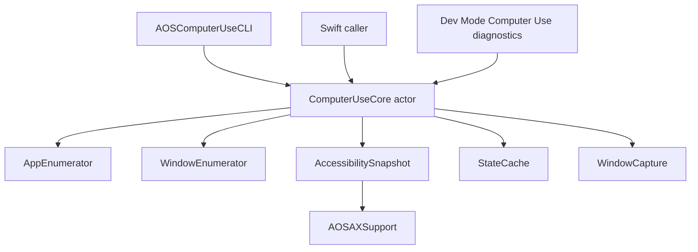

# Computer Use Foundation 设计

## 当前边界

Computer Use 现在只保留 macOS app/window/snapshot/capture foundation。它不再暴露给 Sidecar，也不再包含任何 app 操作能力。

已移除：

- Shell `computerUse.*` JSON-RPC handler
- Sidecar `computer_use_*` tools
- Focus / Input / VisualCursor
- SkyLight event posting、keyboard/mouse injection、focus suppression
- Dev Mode 操作 workbench 与 coordinate reliability target

## 保留模块

```
Sources/AOSComputerUseKit/
  ComputerUseCore.swift
  Apps/
    AppInfo.swift
    AppEnumerator.swift
  Windows/
    WindowInfo.swift
    WindowEnumerator.swift
    WindowCoordinateSpace.swift
  AppState/
    AccessibilitySnapshot.swift
    TreeRenderer.swift
    StateCache.swift
  Capture/
    WindowCapture.swift
    ScreenInfo.swift
```

`AOSComputerUseKit` 仍依赖 `AOSAXSupport`，用于 shared AX primitives、Chromium / Electron web accessibility activation、`_AXUIElementGetWindow` bridging、locator support。`AOSOSSenseKit` 和 `AOSComputerUseKit` 可以共同依赖 `AOSAXSupport`，但不得互相依赖。

## Public API

`ComputerUseCore` 是当前唯一门面：

- `listApps(mode:) -> [AppInfo]`
- `listWindows(pid:) -> [WindowInfo]`
- `getAppState(pid:windowId:captureMode:maxImageDimension:) -> AppStateBundle`

`getAppState` 支持三种 capture mode：

- `som`：AX tree + screenshot
- `vision`：仅 screenshot
- `ax`：仅 AX tree

该 API 是 in-process Swift API。当前没有 JSON-RPC schema、Sidecar tool schema 或 Shell handler 绑定它。Dev Mode 可以直接注入 `ComputerUseCore` 做本地 diagnostics，但该入口只允许查看 foundation 输出，不允许执行 app 操作。

## CLI

`AOSComputerUseCLI` 是 terminal-only interface，用于不启动整个 AOS Shell 时直接调用 `ComputerUseCore`。CLI 的 argv parsing、stdout/stderr formatting、exit code、permission prompts、screenshot file output 都在 executable target 内部；foundation 能力仍由 `AOSComputerUseKit` 提供。依赖方向固定为：

```
AOSComputerUseCLI -> AOSComputerUseKit -> AOSAXSupport
```

`AOSComputerUseKit` 不依赖 CLI、Shell、Sidecar 或 RPC。

支持命令：

- `swift run AOSComputerUseCLI --help`
- `swift run AOSComputerUseCLI grant-permissions`
- `swift run AOSComputerUseCLI list-apps [--mode running|all]`
- `swift run AOSComputerUseCLI list-windows --pid <pid>`
- `swift run AOSComputerUseCLI get-app-state --pid <pid> --window-id <id> [--mode som|vision|ax] [--max-image-dimension <pixels>] [--screenshot-output <path>]`

成功默认输出人类可读文本到 stdout。传 `--json` 时输出机器可读 JSON。错误输出到 stderr，并返回非 0 exit code。`get-app-state --json` 默认把 screenshot base64 放进 JSON；如果传 `--screenshot-output`，CLI 把截图写入指定路径，JSON 只返回截图 metadata 和 `outputPath`。

`grant-permissions` 会请求 Computer Use core 所需的两项权限：

- Accessibility：AX tree / actionable element snapshot 需要。
- Screen Recording：ScreenCaptureKit window screenshot 需要。

该命令会触发 macOS 系统 prompt，并打开对应的 System Settings Privacy pane。授权对象是运行 CLI 的 terminal app（例如 Terminal、Ghostty、Cursor 内置终端），不是 SwiftPM target 名本身。

## 数据流



## 约束

- 不做 app 操作。
- 不注入鼠标或键盘事件。
- 不 suppress 或修改系统焦点。
- 不注册 Sidecar tool。
- 不通过 JSON-RPC 暴露 Computer Use。
- 不保留操作相关 fallback 或 stub。

未来重写 app 操作能力时，应在这个 foundation 上新增明确边界，而不是重新引入隐式 handler 或半可用 tool surface。
